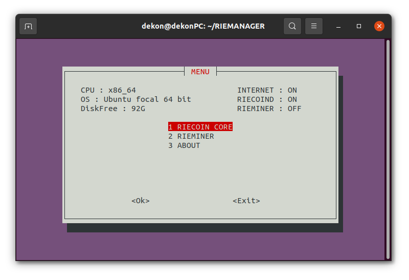
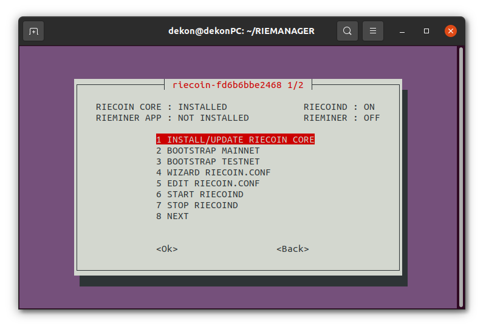
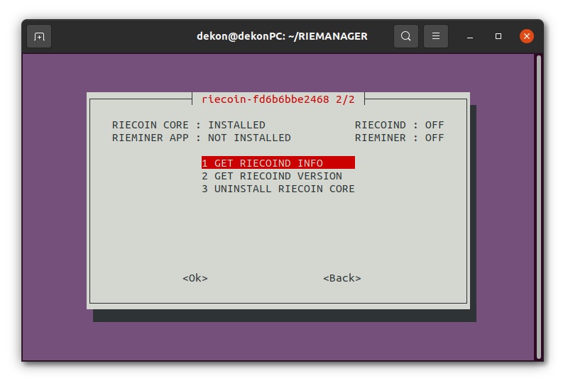
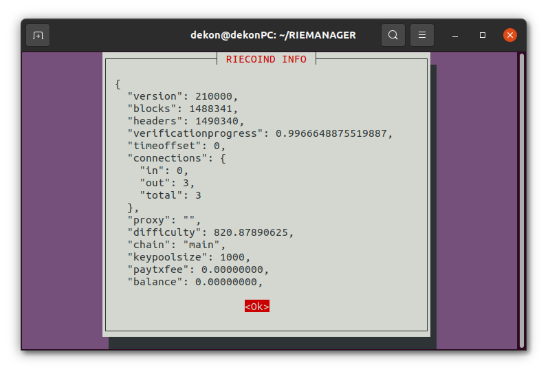
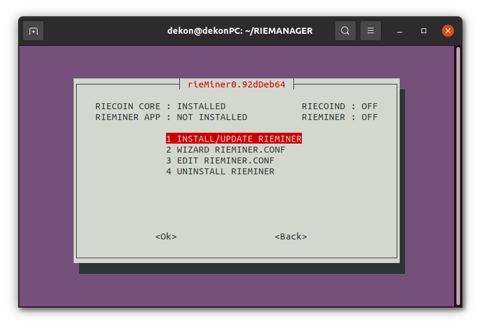
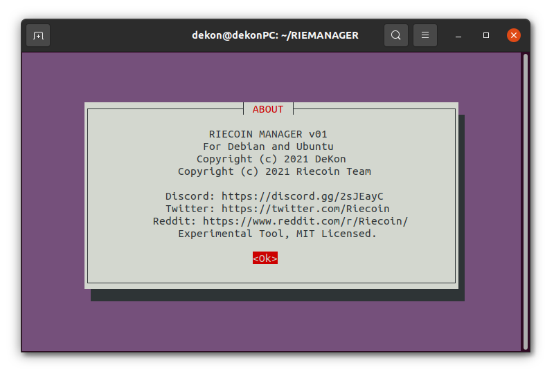

# riemanager-cli
Riecoin Manager cli 
Debian and Ubuntu

Installing and manage Riecoin Core 0.21 

Installing and manage rieMiner 0.92d 

NEVER exit the script during a loading bar. 
Even if it may seem blocked, the work continues in the background.  
Be patient, the speed depends on your hardware and internet connection. 

Works in SSH!
